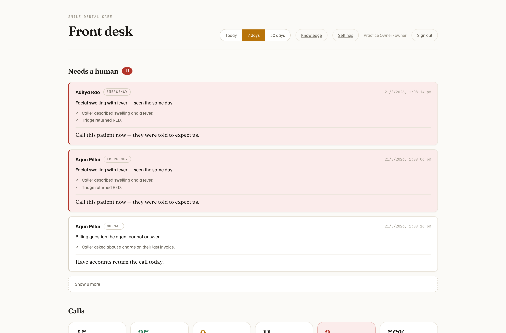
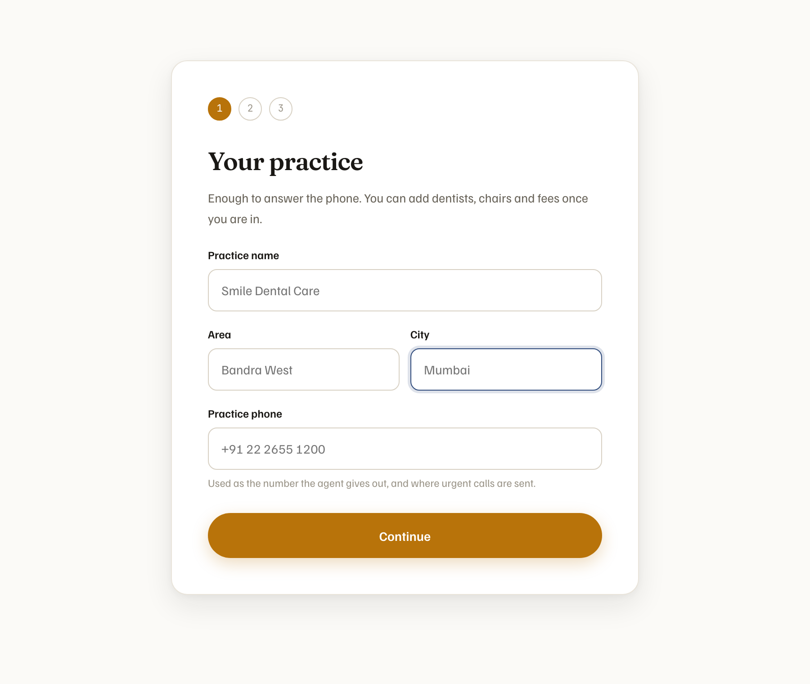
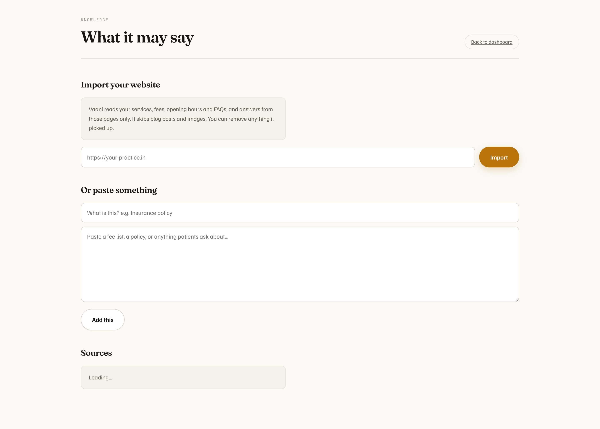
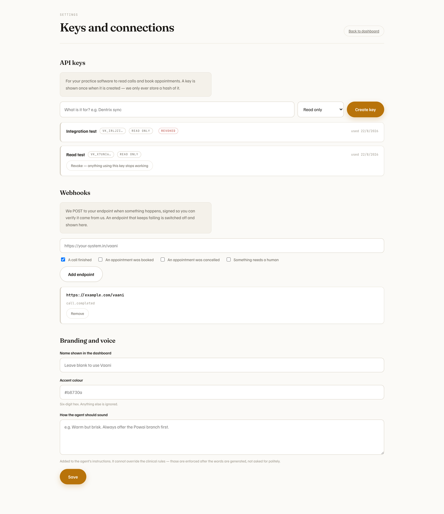

# Vaani — AI front desk for dental practices

A multilingual voice agent that answers the phone for a dental practice. It speaks
eleven Indian languages — English, Hindi, Marathi, Gujarati, Bengali, Tamil, Telugu,
Kannada, Malayalam, Punjabi, and the case that actually matters in India,
**Hinglish**, the code-switched register most callers use.

Each language was verified against Gemini Live rather than assumed: every one is
greeted in its own script, with its own accent, and Marathi comes back as Marathi
rather than as the Hindi that shares its alphabet. A caller can switch mid-call and
the desk follows.

It books, reschedules and cancels against real chair availability, answers questions
from a grounded knowledge base, triages dental emergencies to a safe escalation path,
and hands off to a human when it should.

The agent has no persona name. Asked who it is, it says it is the practice's automated
receptionist and carries on — it never claims to be a person.

**Live:** [dental-voice-agent-pi.vercel.app](https://dental-voice-agent-pi.vercel.app)

| | |
|---|---|
| Take a call | [/console](https://dental-voice-agent-pi.vercel.app/console) — speak to it in the browser |
| Set up a practice | [/start](https://dental-voice-agent-pi.vercel.app/start) — creates a real, isolated tenant |
| The dashboard | [/login](https://dental-voice-agent-pi.vercel.app/login) — `owner@smile.example` |

Everything runs on Vercel, console and calls alike, so there is nothing to wake: a call
opens its socket in about a second and the first audio arrives around two.


---

## The console

Press **Take a call** and talk. Interrupt it mid-sentence; it stops, and it does not
remember saying what you never heard.


Left: live state, mouth-to-ear latency, and the transcript with each speaker in their own
hue. Right: what the agent has understood so far — caller identity, anything committed to
the diary, and every tool call with its latency.

When the line drops, the practice gets the record it actually needs — not a transcript,
but an answer to *"is there anything for me to do about this call?"*


**Needs a human** is the field that matters. An unidentified caller, an unconfirmed
number, an escalated emergency, a call that ended without booking — each is surfaced
rather than buried. Empty is the good outcome.

---

## The dashboard



Ordered by what someone opens it for, which is not the flattering number. **Needs a
human** comes first — ranked emergency-first and capped, because an emergency must never
be the ninth card down — then the call counts, then how the agent behaved, then what it
earned.

Latency is reported as a median *and* a 95th percentile. One nine-second reply matters to
the caller who got it, and a mean hides it completely.

## Setting up a practice



Three steps, and only the first is required to have a working account. A form that asks
for every dentist and every fee before anything works is a form nobody finishes.

## What the agent may say



Point it at the practice website and it reads the services, fees, opening hours and FAQs
— skipping blogs and images. Answers come from those pages only, and when the answer is
not there it says so instead of reaching for the least-bad passage.

## Keys and connections



Scoped API keys and signed webhooks, for a practice management system to read calls and
book against the same diary.

---

## Run it

```bash
pnpm install
cp .env.example .env          # set GEMINI_API_KEY

./scripts/dev.sh              # console :3000, voice server :8787
```

## Deploying it

One deployment. A call is a long-lived WebSocket holding a Gemini Live session,
which used to mean a stateful box of its own — Vercel Functions hold sockets now,
so the call runs in a route beside the console and is warmed by the same traffic.

```
GEMINI_API_KEY=…          the engine; nothing works without it
DATABASE_URL=…            Postgres, for tenants and history
TWILIO_AUTH_TOKEN=…       only if you are wiring a phone number
CRON_SECRET=…             only if you are running outbound campaigns
```

| route | what it is |
|---|---|
| `/api/session` | the browser call — a WebSocket |
| `/api/twilio/stream` | the phone call's audio, both directions |
| `/api/twilio/voice` · `/status` · `/transfer` | Twilio's webhooks, signature-checked |
| `/api/cron/outbound` | one pass of the dialler, on a schedule |
| `/api/health` | readable without credentials; says whether the engine is keyed |

**The one thing this costs.** A function has a `maxDuration`, so a call has a
ceiling — 300 seconds on the Hobby plan. That is generous for a demo and wrong
for a real front desk, so `apps/voice-server` is still here: the same call code
(`@vaani/session-host`) behind a plain Node server, with a `Dockerfile`,
`render.yaml` and `fly.toml`. Run it if you need calls longer than five minutes,
and point the console at it with `NEXT_PUBLIC_VOICE_SERVER_URL`.

It is also what local development uses, because `next dev` cannot serve a
WebSocket route — `./scripts/dev.sh` starts both.

Open <http://localhost:3000>, then <http://localhost:3000/console> to take a call.

```bash
pnpm test                     # 640 tests
pnpm tsx scripts/e2e-call.ts  # drives a real call with synthesised caller speech
node scripts/browser-audit.mjs # real browser, fake mic, asserts behaviour §-by-§
```

Database-backed tests run against real Postgres in-process via pglite, so the
SQL under test is the SQL that ships. Every multi-tenant case seeds **two**
practices into the same tables — a single-tenant fixture cannot fail the test
that matters, because a missing `WHERE org_id = ?` still returns the right rows
when only one clinic's rows exist.

---

## How it works

**Gemini Live, native audio.** Speech goes in and speech comes out of one model —
there is no separate STT, LLM and TTS. This is the whole architectural bet, and it is
the reason it does not sound like an agent.

A cascaded pipeline structurally cannot sound human: the synthesiser never learns what
the sentence *meant*, so it guesses prosody from text alone. It will read a genuine
question with the falling pitch of a statement, put the stress on the wrong word in
"*Thursday* works, or Friday?", and flatten every hesitation the caller uses to judge
whether they are being understood. Native audio carries intent from comprehension
straight through to articulation.

The model also owns turn-taking. Its VAD decides when the caller has started and
stopped, so barge-in is immediate and automatic — there is no interrupt button, because
a receptionist does not have one.

**Language is followed, not configured.** Detection is per turn. When the caller
switches to Hindi the agent switches with them and *stays* switched, and the accent
follows — `speechConfig.languageCode` is repinned and the session reconnects on its
resumption handle at a turn boundary, so it is never cut mid-sentence. Same voice
throughout; a voice that changes identity mid-call breaks the illusion instantly.

Eleven languages, listed in the console header in their own scripts:

| | | |
|---|---|---|
| English | हिन्दी Hindi | Hinglish |
| मराठी Marathi | ગુજરાતી Gujarati | বাংলা Bengali |
| தமிழ் Tamil | తెలుగు Telugu | ಕನ್ನಡ Kannada |
| മലയാളം Malayalam | ਪੰਜਾਬੀ Punjabi | |

Three details make the difference between "supports Tamil" and *speaking* Tamil:

- **The accent is fixed when the session opens**, so the chosen language travels in the
  WebSocket URL rather than in a message. A message has to win a race against the
  connect to matter, and it was losing it — the greeting, the one moment a wrong
  language is most obvious, came out in English.
- **Register is specified per language.** A real receptionist says "appointment",
  "cleaning" and "X-ray" in English inside a Tamil sentence. Pure-Tamil coinages for
  clinical words are correct and sound like a news bulletin, so the prompt asks for the
  spoken form, not the literary one.
- **Hindi and Marathi share an alphabet**, so script alone cannot separate them.
  Detection falls back to grammar — *मी*, *आहे*, *तुम्ही* against *मैं*, *है*, *आप* —
  and ties go to Hindi as the cheaper error.

Clinical refusals and emergency triage scripts are hand-written in all eleven, not
translated at runtime. Those are the sentences a caller hears at the two moments that
matter most, and a test asserts each one is present and in the right script.

**Clinical safety is three layers, and the last one has no bypass.** Prompt rails,
`triage_symptoms` owning every urgency decision, and a post-generation guard sitting
between the agent and the transport. A blocked utterance is replaced before a single
sample is synthesised. Diagnosis, prescription, prognosis and guarantees are hard-blocked
— in all three languages, including when the same question comes back rephrased.

**Emergency triage is rules, not a model.** An avulsed tooth has roughly a 30-minute
re-implantation window. That decision is hard-coded, because a model that is right 97% of
the time is wrong about someone's tooth once every thirty-three calls.

**Pronunciation is measured, not assumed.** Doctor names, Mumbai place names and clinical
terms carry explicit stress marks (`Iyer [EYE-yer]`, `Deshpande [desh-PAAN-day]`,
`Bandra [BAAN-dra]`) fed to the model as custom vocabulary. Scored by round-trip —
synthesise, transcribe, compare — which moved it from 79% to 86%.

**Caller data fails closed.** `/crm` and `/practice` return patient names, mobile
numbers and the reason someone rang a dentist. With no `VAANI_ADMIN_TOKEN` set they
answer loopback only — which is local development and nothing else; a token or an
allowed origin is required to reach them, or to open a call session, from anywhere
else. Session ids are random, because the session id is also the CRM record key.

---

## Layout

```
packages/
  shared/      wire protocol (zod), audio format, PII redaction, base64
  live/        Gemini Live session — config, reconnection, accent switching
  agent/       tools, triage, safety guard, sentiment, prompts
  db/          multi-tenant schema, repositories, auth, analytics, API keys
  telephony/   Twilio — mu-law codec, TwiML, media stream, business hours
  knowledge/   chunking, hybrid retrieval, website crawler, SSRF guard
  outbound/    campaign builders, calling policy, dialler
  evals/       scenarios, scoring, runner
  core/        Transport interface (+ the earlier cascaded pipeline, see below)
  providers/   STT/LLM/TTS adapters used by the cascaded pipeline
apps/
  voice-server/  browser + phone calls, tools, guards, outbound worker
  web/           landing, console, dashboard, knowledge, settings, onboarding, API
```

## What it does now

| | |
|---|---|
| **Phone calls** | Twilio inbound, caller-ID recognition, business-hours routing, after-hours emergency routing, transfer with ring-out escalation |
| **Multi-tenant** | every clinic-owned row carries `org_id`; the repository takes the org in its constructor so no query can be built without one |
| **Scheduling** | a root canal goes to an endodontist, in a chair with rotary endo, inside branch hours, with turnaround — booking re-checks inside the transaction |
| **Outbound** | reminders, recall, waitlist recovery, missed-call recovery, follow-up — with consent, calling windows and attempt limits |
| **Knowledge** | import a website or paste text; hybrid retrieval that returns *nothing* rather than the least-bad passage |
| **Dashboard** | needs-a-human first, then calls, agent latency percentiles, and what it earned |
| **Integrations** | scoped API keys, signed webhooks, white-label branding |
| **Evals** | 14 scenarios; `must` failures gate, quality is graded separately |

`packages/core` and `packages/providers` hold the original cascaded implementation —
turn manager, adaptive endpointing, barge-in truncation, sentence chunker, hallucination
filter, phrase cache. It is still tested and still works, but it is **not** on the live
path; the voice server uses `@vaani/live`. It is kept because the `Transport` interface
it defines is what telephony will plug into, and because the truncation and endpointing
work is worth not throwing away.

Design and plan documents live in [docs/superpowers/](docs/superpowers/).

---

## Seeded practice

Smile Dental Care — 3 branches (Bandra West, Andheri West, Powai), 6 dentists with
qualifications and specialties, 12 treatments indexed by the names patients actually use
(*safai* → scaling, *akal daadh* → wisdom tooth, cap → crown, RCT → root canal).

Every slot the agent offers is read from the diary at the moment it speaks.

---

## Mobile


---

## A dead end worth recording

Serving calls straight from the browser — no voice server at all — would make
the console deployable as one static site. Gemini issues ephemeral auth tokens
for exactly that: the API key stays server-side and the browser gets a
single-use credential.

It does not work here, and the reason is not obvious. The SDK routes any
`auth_tokens/…` credential to `BidiGenerateContentConstrained` rather than
`BidiGenerateContent`, and on that endpoint this project gets **audio only** —
`outputAudioTranscription` returns nothing and tool calls are never emitted,
across every model and config combination tried. A console with no transcript
that cannot book is worse than one that says plainly it needs a server, so the
browser path was removed rather than shipped.

Worth re-testing when the constrained endpoint leaves preview. The session code
is already isomorphic, so it is a small change if it starts working.

---

## Not built

**WhatsApp.** The `Transport` interface exists for it and the conversation, diary and
knowledge are channel-agnostic, so it is an adapter rather than a second pipeline.

**Billing and subscriptions.** Deliberately out of scope.

**A production security posture on the demo database.** The hosted database holds only
seeded, synthetic records — the "patients" are invented names with invented numbers — so
its network allow-list is open to let the serverless console reach it. That is the right
trade for a demo and the wrong one the moment a real practice's data is in there: narrow
the allow-list, or move the console onto the same private network as the database.

**Versioned migrations.** `migrate.ts` creates tables and adds columns, both
idempotently. A rename or a retype silently does nothing, which is fine while the only
rows are demo data and stops being fine the moment a real practice's patients are in
there. drizzle-kit is already configured for the handover.

Compliance posture is *architected toward* HIPAA / India DPDP — consent logging, PII
redaction, audit trail — but it is not certified, and that claim is not made.
